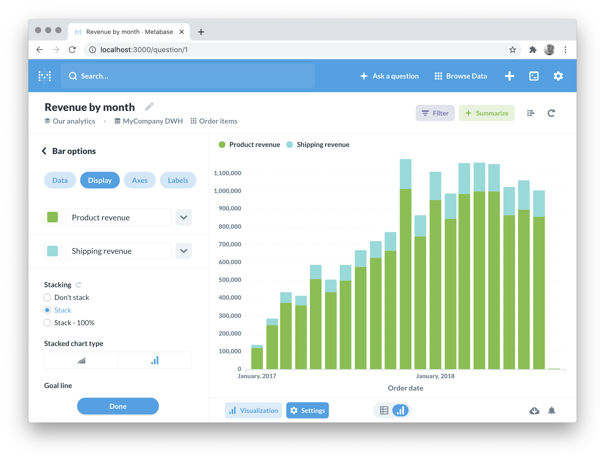
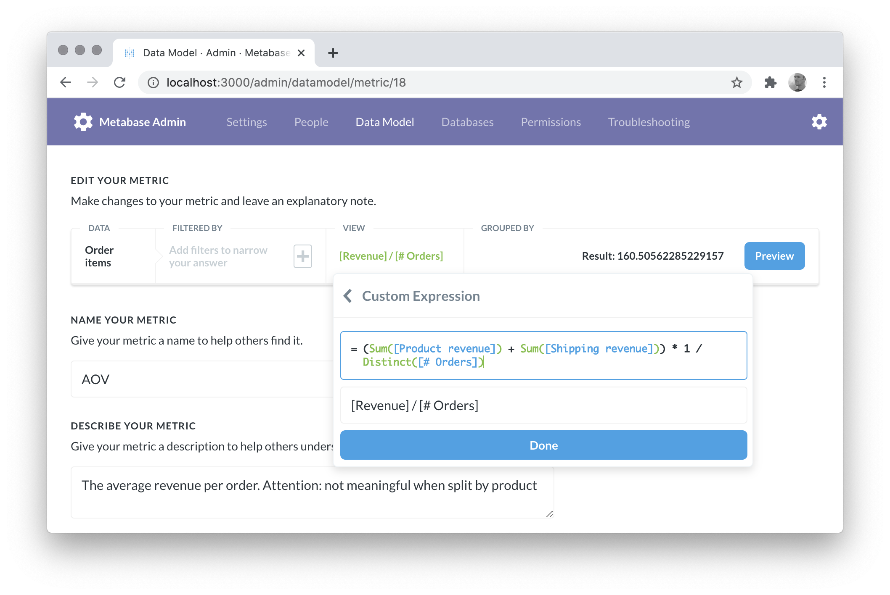
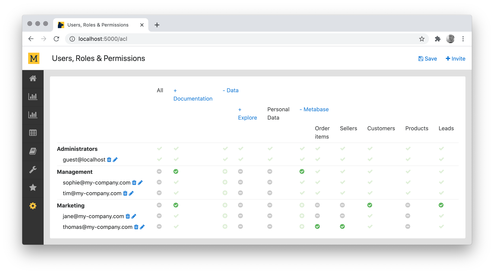
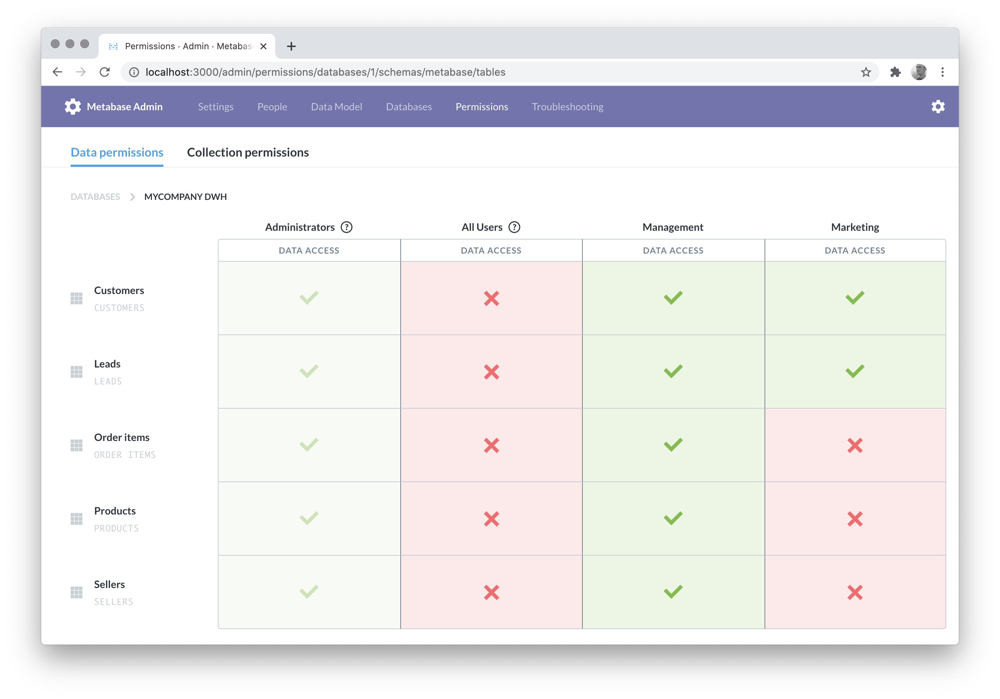

# Mara Metabase

[](https://travis-ci.org/mara/mara-metabase)
[](https://github.com/mara/mara-metabase/blob/master/LICENSE)
[](https://badge.fury.io/py/mara-metabase)
[](https://communityinviter.com/apps/mara-users/public-invite)


Automating the setup and configuration of Metabase instances. Comes with

- Functions for adding users, databases & settings

- Syncing of field descriptions and metrics defined with [Mara Schema](https://github.com/mara/mara-schema) to Metabase

- Syncing of users and permissions to Metabase

- A Makefile for running Metabase locally


&nbsp;

## Installation

To use the library directly, use pip:

```
pip install mara-metabase
```

or

```
pip install -e git+https://github.com/mara/mara-metabase.git
```

For an example of an integration into a flask application, have a look at the [mara example project 1](https://github.com/mara/mara-example-project-1).


&nbsp;

## Running Metabase

From within a project, include [https://github.com/mara/mara-metabase/tree/master/.scripts/metabase.mk] in your project Makefile (as for example in [https://github.com/mara/mara-example-project-1/blob/master/Makefile](https://github.com/mara/mara-example-project-1/blob/master/Makefile)).

Running `make setup-metabase` will download a Metabase jar file, run database migrations, add an admin user & create a database connection to the data warehouse. Then, running `make run-metabase` will start Metabase on port 3000:



You can log in with the default username `admin@my-company.com` and the password `123abc` (configurable via [mara_metabase/config.py](https://github.com/mara/mara-metabase/tree/master/mara_metabase/config.py), please change in production).

For running Metabase in production, please have a look at [https://www.metabase.com/docs/latest/operations-guide/installing-metabase.html](https://www.metabase.com/docs/latest/operations-guide/installing-metabase.html).

&nbsp;

## Features

### Programatically setting up Metabase

The file [mara_metabase/setup.py](https://github.com/mara/mara-metabase/tree/master/mara_metabase/setup.py) contains functions for configuring a Metabase instance by directly writing to its metadata database (rather than manually configuring an instance through the UI). These functions are particularly useful when multiple Metabase instances are maintained (e.g. one for each testing / staging environment).

There is a flask cli command for running the `setup` function: `flask mara_metabase.setup`.

**Danger: this will remove any other configured database connections from metabase!**

&nbsp;

### Metadata sync

If you have a data warehouse schema defined in [Mara Schema](https://github.com/mara/mara-schema), then you can automatically sync field descriptions and metric definitions with the `update_metadata` function in [mara_metabase/metadata.py](https://github.com/mara/mara-metabase/tree/master/mara_metabase/metadata.py).

Here's an example of an automatically synced definition for the metric average order value:



This function assumes that all reporting tables were created using the sql-generation features of Mara Schema.

The schema sync can be triggered manually with `flask mara_metabase.update-metadata`.

Have a look at [https://github.com/mara/mara-example-project-1/blob/master/app/pipelines/update_frontends/\_\_init\_\_.py](https://github.com/mara/mara-example-project-1/blob/master/app/pipelines/update_frontends/__init__.py) for how to integrate schema sync into a data pipeline.

&nbsp;


## Syncing of users, groups & permissions from [Mara ACL](https://github.com/mara/mara-acl)

Once you add the Metabase ACL resource in [mara_metabase/views.py](https://github.com/mara/mara-metabase/tree/master/mara_metabase/views.py) to your project, you can easily control which users can query which data set:



The sync must be explicitly enabled in your setup code to not interfere with a metabase instance which has its own user management:

```python
# e.g. in app/ui/__init__.py 
import mara_metabase.acl
mara_metabase.acl.enable_automatic_sync_of_users_and_permissions_to_metabase()
```

**Danger: Enabling this feature will overwrite any existing users, groups & permissions in Metabase**


After enabling, all users in Mara ACL will be synced to Metabase together with their respective groups on "Save" of the permissions. Permissions in Metabase can be given for all or for individual data sets.


In this example, users from the "Management" group can query all data sets, and users from "Marketing" only "Customers" and "Leads" (with the exception of Thomas who can also query "Order items" and "Sellers").

This is the same data in the Metabase admin UI:




&nbsp;

The easiest way to try out Mara Metabase is to run the [mara example project 1](https://github.com/mara/mara-example-project-1).
